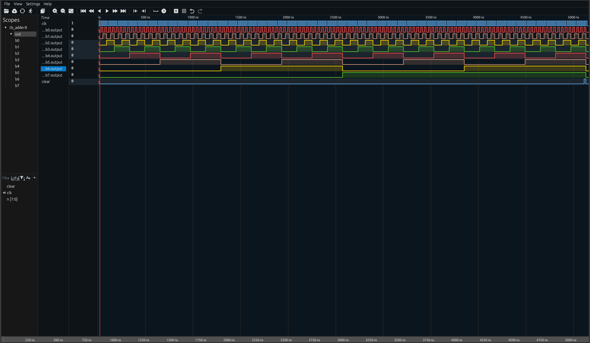

# Adder 8

Extrapolation of a 3 bit addition combinational logic diagram from  'Digital Design from Scratch Volume 1', page 77 

- Created from [vhdl_config](https://github.com/mbcarruthers/vhdl_config.git) boilerplate 